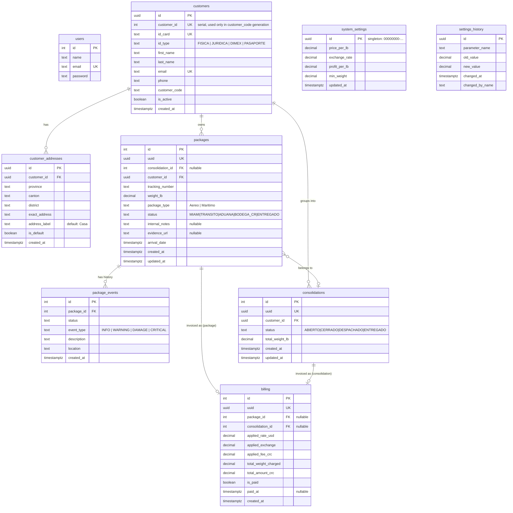

# ERD.md

Entity relationships derived from SQL queries and TypeScript types. No DDL files exist.
See DATABASE_SPEC.md for full column and index documentation.

---

## Entity Relationship Diagram



---

## Relationships

### `customers` → `customer_addresses` (1 : N)
One customer has one or more delivery addresses. The service enforces at least one address per customer and exactly one `is_default = true`. Addresses are created atomically with the customer via SQL CTE.

**Evidence:** `customers.repo.ts:48-59` (INSERT in CTE), `customers.repo.ts:99` (SELECT with `json_agg`)

---

### `customers` → `packages` (1 : N)
One customer owns zero or more packages. A package always belongs to exactly one customer and cannot be reassigned.

**Evidence:** `logistics.repo.ts:69` (`LEFT JOIN customers c ON p.customer_id = c.id`)

---

### `customers` → `consolidations` (1 : N)
One customer can have zero or more orders (shipment orders). The `customer_id` FK is present in the `Consolidation` type but there is no JOIN query in the codebase that uses it directly.

**Evidence:** `logistics.types.ts:52` (`customer_id: string` in `Consolidation`)

---

### `packages` → `consolidations` (N : 0..1)
Many packages can belong to one shipment order, or a package can have no shipment order (`consolidation_id IS NULL`). A package joins a shipment order via `UPDATE packages SET consolidation_id = ...`. There is no code to remove a package from a shipment order.

**Evidence:** `logistics.repo.ts:105-109` (UPDATE) and `logistics.repo.ts:111-116` (weight recalculation)

---

### `packages` → `package_events` (1 : N)
One package has zero or more events. Events are ordered by `created_at DESC` when retrieved. No INSERT into `package_events` exists in the application code — the writer is not implemented.

**Evidence:** `logistics.repo.ts:39-43` (SELECT with `json_agg`)

---

### `packages` → `billing` (1 : 0..1) [package path]
A single package can have zero or one billing record when invoiced individually. `billing.package_id` is set; `billing.consolidation_id` is null.

**Evidence:** `logistics.repo.ts:168` (`package_id: type === 'PACKAGE' ? targetId : null`)

---

### `consolidations` → `billing` (1 : 0..1) [shipment order path]
A shipment order can have zero or one billing record. `billing.consolidation_id` is set; `billing.package_id` is null.

**Evidence:** `logistics.repo.ts:169` (`consolidation_id: type === 'CONSOLIDATION' ? targetId : null`)

---

### `system_settings` → `settings_history` (logical, no FK)
`settings_history` has no FK to `system_settings`. The relationship is logical: every changed field in `system_settings` produces one row in `settings_history`. The two tables are linked only by the application layer.

**Evidence:** `settings.service.ts:10-24` (loop over fields, calling `logHistory`)

---

## Data flow

```
User (operator login)
    ↓
users (authentication)
    ↓
SESSION_ACCESS_TOKEN (cookie)
    ↓
Every API request

customers
    ├──► customer_addresses  (addresses created with customer atomically)
    ├──► packages            (customer_id FK)
    │        ├──► package_events   (package_id FK — no writer in code)
    │        ├──► consolidations   (packages.consolidation_id FK)
    │        │        └──► billing (consolidation_id FK)
    │        └──► billing          (package_id FK)
    └──► consolidations      (customer_id FK)

system_settings  (read-only by use-package-calculator.ts for cost preview)
    └──► settings_history    (one row per changed field, no FK)
```

---

## Key structural constraints

| Constraint | Where enforced |
|---|---|
| `billing.package_id` and `billing.consolidation_id` are mutually exclusive | Application code (`logistics.repo.ts:168-169`) — not a DB CHECK |
| At least one `customer_addresses.is_default = true` per customer | Service layer (`customers.service.ts:17-19`) |
| `weight_lb > 0` | Service layer (`logistics.service.ts:73`) |
| Unique `id_card` and `email` per customer | Service check before INSERT + implied DB UNIQUE constraint |
| `system_settings` always has exactly one row | Application always UPDATEs, never INSERTs |
| Shipment order weight = `SUM(packages.weight_lb)` | Recalculated on every shipment order operation |

---

## Questions

### 1. What business does this database currently model?

A **Costa Rica package import courier service**. Customers ship goods from the United States (received at a Miami warehouse) and the courier tracks each parcel through a defined status chain — Miami intake → international transit → Costa Rican customs → local warehouse → final delivery. The business charges customers by weight (minimum 1 lb), converts to Costa Rican colones using an exchange rate, adds a fixed fee, and issues invoices per package or per shipment order.

The database models the core operational loop: **customer registry → package intake → status tracking → shipment order → invoicing**.

---

### 2. What spreadsheet concepts already exist in the database?

| Typical spreadsheet | Database equivalent |
|---|---|
| Customer list (name, ID, address) | `customers` + `customer_addresses` |
| Package intake log (tracking#, weight, type, date) | `packages` |
| Package status tracker | `packages.status` + `package_events` (read-only currently) |
| Shipment order / grouping | `consolidations` + `packages.consolidation_id` |
| Invoice log (amount, rates, weight) | `billing` with all rate snapshots |
| Rate configuration sheet | `system_settings` |
| Rate change audit log | `settings_history` |
| Operator/user list | `users` |

---

### 3. What spreadsheet concepts do NOT exist yet?

| Missing concept | Notes |
|---|---|
| **Payment register** | `billing.is_paid` + `billing.paid_at` exist but there is no payment transaction table, payment method, receipt number, or reconciliation log |
| **Customer account balance / statement** | No table tracks cumulative debt, credits, or running balance per customer |
| **Tiered or zone-based pricing** | `system_settings` has a single flat rate (`price_per_lb`); no table for weight tiers, route zones, or package-type-specific pricing |
| **Operator event log** | `package_events` has no writer in code; there is no table tracking which operator performed which status update |
| **Warehouse location / slot** | No table models physical locations within `BODEGA_CR` (aisle, shelf, bin) |
| **Delivery schedule / route** | No table for delivery routes, drivers, or scheduled delivery dates |
| **Damage / claim registry** | `internal_notes` and `evidence_url` are overwritten on each update; there is no permanent damage claim or insurance table |
| **Sender information** | No table stores who sent the package from the US side (sender name, address, reference) |

---

### 4. What new tables would be required to fully replace the spreadsheets?

These are gaps identified from the analysis above. No implementation is proposed here.

| New table | Purpose |
|---|---|
| `payment_transactions` | Records each payment event: amount, method, reference, timestamp; links to `billing.id`. Would make `billing.is_paid` derivable. |
| `rate_tiers` or `pricing_rules` | Stores weight-bracket or package-type-specific rates, replacing or extending the flat rate in `system_settings`. |
| `package_event_writer` / fix to existing flow | Currently `package_events` has no INSERT path. Adding one (or documenting that it is external) is needed before the table is useful. |
| `customer_balance_ledger` | Running balance per customer: charges (`billing`), payments, adjustments. Enables statements and credit tracking. |
| `damage_claims` | Permanent record of reported damage: linked package, description, evidence URL, claim status, resolution. Replaces overwritten `internal_notes`/`evidence_url`. |

---

### 5. What existing tables should be reused instead of recreated?

| Existing table | How to reuse |
|---|---|
| `customers` | Already models the client registry. Extend with additional contact fields if needed; do not create a parallel customer table. |
| `packages` | The core parcel entity. New features (e.g., sender info, customs value) should add columns here, not create a shadow table. |
| `billing` | The invoice record. Extend with `payment_method`, `receipt_number` columns rather than creating a separate invoice table. |
| `consolidations` | Already models shipment order grouping. Reuse for any bulk-shipping scenario. |
| `system_settings` | Extend with additional rate fields (e.g., per-type rates) before creating a new configuration table. |
| `settings_history` | Already provides field-level audit for settings changes; reuse the pattern for other auditable entities. |
